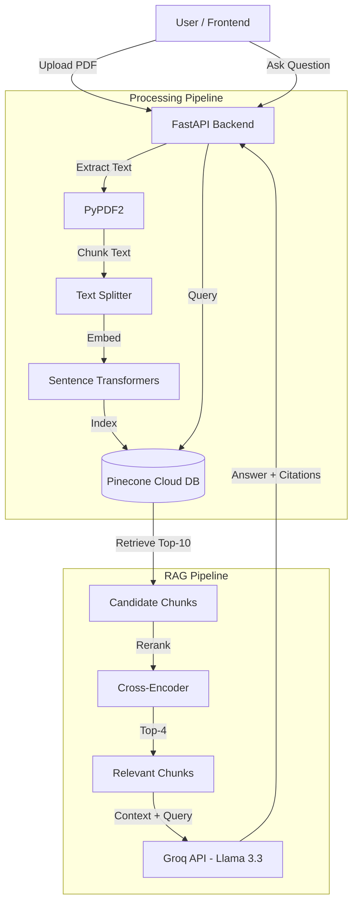

# Mini Rag

A highly responsive and visually engaging Retrieval-Augmented Generation (RAG) application that allows users to chat with their PDF documents. The system uses **FastAPI** for the backend, **Groq (Llama 3.3)** for the LLM, **Pinecone** for serverless cloud vector search, and a **Cross-Encoder Reranker** for improved retrieval accuracy.

## Architecture



## Features

- **Upload and Index**: Drag and drop multiple PDF files to index them in the Cloud.
- **RAG Engine**: 
    - **Embeddings**: `sentence-transformers/all-MiniLM-L6-v2` (384 dimensions).
    - **Vector DB**: Pinecone Serverless (AWS us-east-1).
    - **Reranker**: Cross-Encoder `ms-marco-MiniLM-L-6-v2` for improved relevance.
    - **LLM**: Llama-3.3-70b-versatile via Groq Cloud.
- **Frontend**: Premium dark-themed HTML/CSS/JS interface.
- **Citations**: Returns inline citations with **Source PDF and Page Numbers**.
- **Metrics**: Displays request processing time and estimated LLM cost per query.

## Tech Stack

| Component | Technology |
|-----------|------------|
| Backend | Python, FastAPI, Uvicorn |
| Frontend | HTML5, CSS3, Vanilla JavaScript |
| Vector DB | Pinecone (Serverless) |
| Embeddings | Sentence Transformers |
| Reranker | Cross-Encoder |
| LLM | Groq Cloud (Llama 3.3) |

## Installation and Setup

1. **Clone the repository**:
   ```bash
   git clone <repository-url>
   cd rag_chatbot_usingPDF-main
   ```

2. **Create a virtual environment** (recommended):
   ```bash
   python -m venv venv
   
   # Windows
   venv\Scripts\activate
   
   # Mac/Linux
   source venv/bin/activate
   ```

3. **Install dependencies**:
   ```bash
   pip install -r requirements.txt
   ```

4. **Environment Configuration**:
   Create a `.env` file in the root directory:
   ```env
   GROQ_API_KEY=your_groq_api_key
   PINECONE_API_KEY=your_pinecone_api_key
   ```

## How to Run

1. Start the FastAPI server:
   ```bash
   uvicorn backend:app --reload
   ```

2. Open your browser and navigate to:
   ```
   http://localhost:8000
   ```

3. Upload a PDF to trigger indexing in Pinecone, then ask questions about your documents.

## RAG Implementation Details

### 1. Vector Database
- **Technology**: Pinecone (Cloud/Serverless)
- **Index**: `mini-rag-index` (Cosine metric)
- **Upsert Strategy**: Batched upsert (100 vectors/batch)

### 2. Embeddings and Chunking
- **Model**: `all-MiniLM-L6-v2` (384 dimensions)
- **Chunking Strategy**: 
    - Size: 1000 characters
    - Overlap: 200 characters
    - Smart boundary detection (periods, newlines)
- **Metadata**: Preserves `source_file` and `page_number` for accurate citations

### 3. Retriever with Reranking
- **Stage 1**: Top-10 retrieval using Cosine Similarity from Pinecone
- **Stage 2**: Cross-Encoder reranking to select Top-4 most relevant chunks

### 4. LLM and Answering
- **Provider**: Groq Cloud
- **Model**: `llama-3.3-70b-versatile`
- **System Prompt**: Enforces strict context adherence and detailed answers

## API Endpoints

| Endpoint | Method | Description |
|----------|--------|-------------|
| `/api/upload` | POST | Upload and index PDF files |
| `/api/ask` | POST | Ask a question about indexed documents |
| `/api/status` | GET | Get system status and indexed files |
| `/api/clear` | POST | Clear the knowledge base |

## Troubleshooting

**Server crashes immediately after starting:**
- Check if port 8000 is already in use: `netstat -ano | findstr :8000`
- Kill existing processes: `taskkill /F /IM python.exe`

**API Key errors:**
- Ensure `.env` file exists in the root directory
- Check that API keys have no extra whitespace or line breaks
